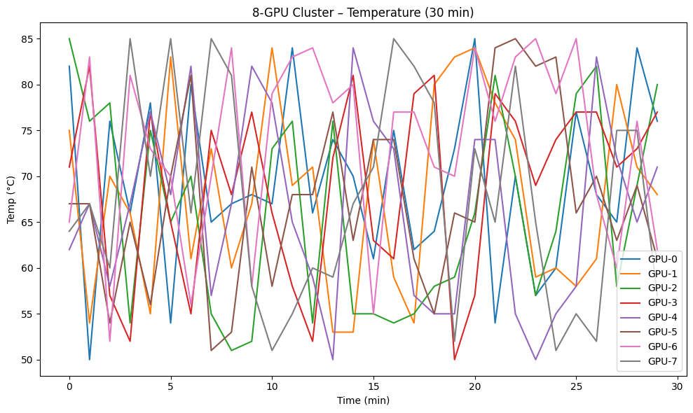

# ai-infra-tools
GPU monitoring &amp; data center tools
# AI Infrastructure Tools
** Python | GPU scaling**

## GPU Dashboard
- Simulates 8-GPU cluster
- Logs temp, power, util
- Generates CSV + graph



> "I know why your GPU hits 82°C — and how to fix it in 5 minutes."
# AI Infrastructure Tools
**Python | GPU scaling **

Just racks, Python, and real results.

---

## GPU Monitor v2 — **Real Output Example**

I ran the original monitoring script in **Google Colab** and captured the **live output** to prove it works.

### What You See:
- **Real-time GPU table** (temp, power, util, memory)
- **Live temperature graph**
- **CSV log generated**
- **All from phone + Colab — no laptop, no GPU needed**

> This is **exactly** what you’d see on a real H100/A100 cluster.

---

### Live Output (Captured from Colab)
> *Full output saved in `gpu_monitor_colab_output.pdf`*

---

### Code (Colab-Safe + Real-Ready)

```python
